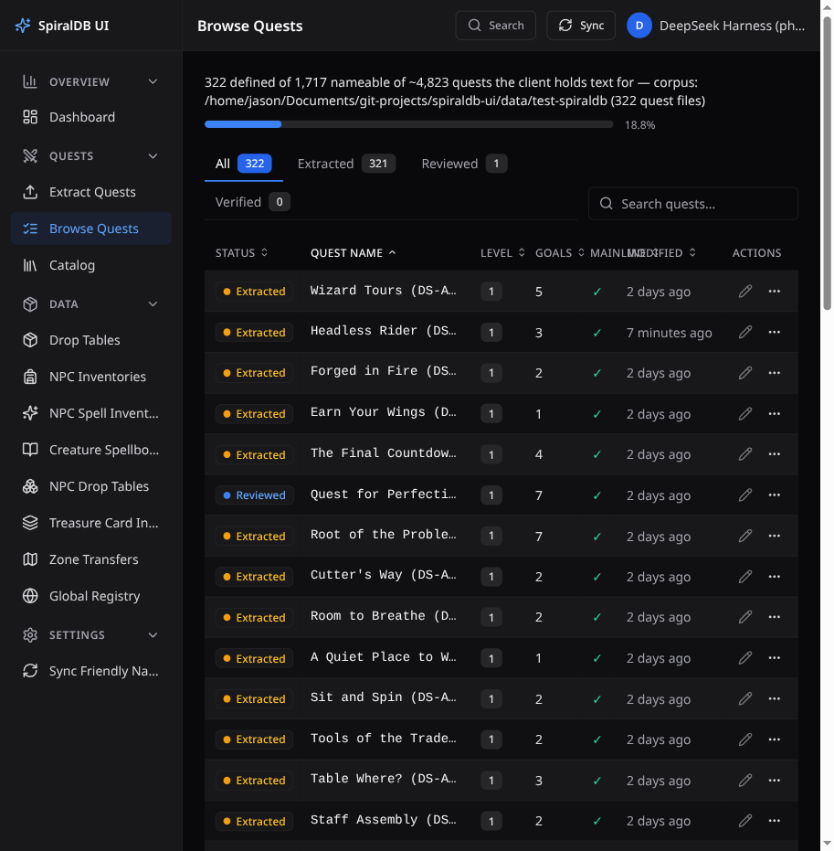
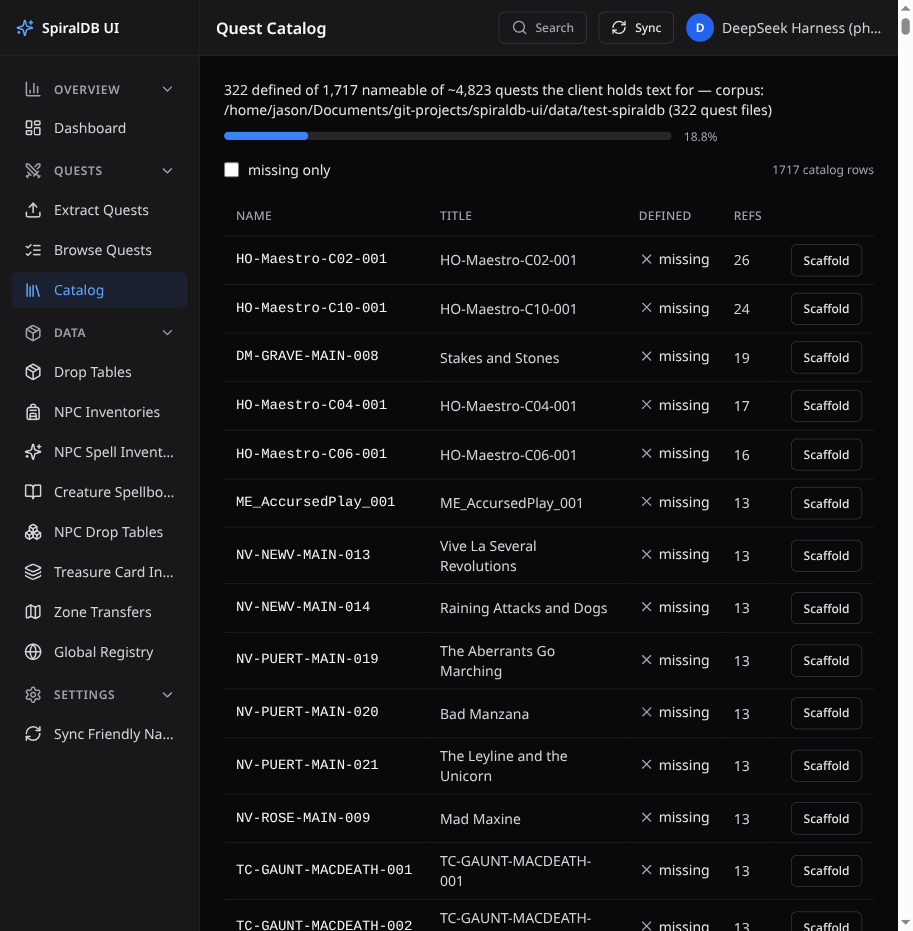
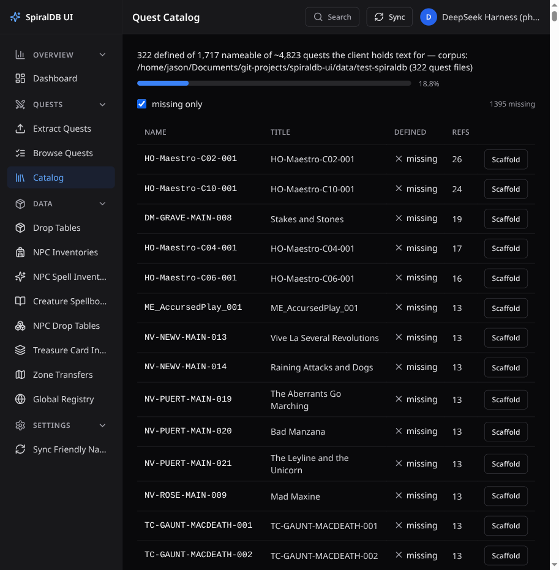

# p6-11 tier-2 evidence — the coverage header, the catalog worklist and the missing-only filter, in a live stack

**Story:** p6-11 (plan task 6.10) · **date:** 2026-09-28 · **stack:** one this story started

```
$ SPIRALDB_UI_DB=/tmp/p6-11/scratch.db SPIRALDB_UI_SKIP_IMPORT=1 \
  PORT=3182 VITE_API_PORT=3182 VITE_PORT=5182 npm run dev
[server] [spiraldb-ui] database ready at /tmp/p6-11/scratch.db
[server] [spiraldb-ui] API listening on http://127.0.0.1:3182 (loopback only)
[client]   ➜  Local:   http://localhost:5182/
```

`/tmp/p6-11/scratch.db` is a **copy** of the synced scratch clone (`/tmp/p6-10/scratch2.db`,
sha256 `9bd8c145…`, left untouched) whose `settings.spiraldb_path` was pointed at the frozen D17 clone
(`data/test-spiraldb`, 322 quest files) so the corpus clause names the corpus the numbers came from. The live
`data/spiraldb-ui.db` was never opened by this stack (its hash is pinned at the bottom of this file).

## 1. The coverage header equals the `coverage` view (ac1)

The view row, the API response and the rendered text, captured in the same session:

```
$ node -e "…new Database('/tmp/p6-11/scratch.db',{readonly:true}).prepare('select * from coverage').get()…"
coverage { nameable: 1717, id_space: 4823, defined: 322, missing: 1395, references: 2855 }

$ curl -s http://localhost:5182/api/quests/coverage
{"nameable":1717,"id_space":4823,"defined":322,"missing":1395,"references":2855,
 "corpus":{"spiraldb_path":"/home/jason/Documents/git-projects/spiraldb-ui/data/test-spiraldb",
           "quest_files":322}}

$ browser · getByTestId('coverage-headline').textContent()
322 defined of 1,717 nameable of ~4,823 quests the client holds text for — corpus:
/home/jason/Documents/git-projects/spiraldb-ui/data/test-spiraldb (322 quest files)
$ browser · getByTestId('coverage-percent').textContent() → 18.8%
```

- **Not recomputed**: the five axes are read once, from the view, by `readCoverage`
  (`server/src/services/questCoverage.ts`), and asserted against a raw `SELECT … FROM coverage` the **test**
  spells out (`tests/unit/quest-coverage.test.ts`), never against the service's own constant.
- **Not a constant**: the unit suite re-reads after mutating the catalog (`defined` 3 → 4, `nameable` 7 → 11) and
  asserts the sentence changed and the stale digits are gone; the tier-1 arm
  (`quests-catalog.spec.ts`'s "falsification arm") mounts a *different* coverage payload and the header follows
  it. A source scan over the four files that build or render the header finds none of
  `1447/1717/322/4823/4830/2855/1395` in code, with a deliberate-constant negative control proving the detector
  fires.
- **The corpus is named** by the same sentence, from `corpus` — the resolved `spiraldb_path` and the
  `QuestTemplate/*.json` count just measured (322 here; the API reads 328 against the owner's fork).

## 2. The same header on the Quests list page (spec §10)

`/quests` renders the identical sentence above the status tabs, and keeps its own list working:

```
$ browser · goto http://localhost:5182/quests
getByTestId('coverage-headline').textContent()
  → 322 defined of 1,717 nameable of ~4,823 quests the client holds text for — corpus: …/data/test-spiraldb (322 quest files)
getByText(/^Showing /).textContent() → Showing 1-50 of 322
```



## 3. The Catalog view and the missing-only filter (ac2, D85)

```
$ browser · goto http://localhost:5182/quests/catalog
coverage-headline        → the sentence above
catalog-count (unfiltered) → "1717 catalog rows"
rows                      → 1717
row DM-GRAVE-MAIN-008      → "DM-GRAVE-MAIN-008Stakes and Stonesmissing19Scaffold"

$ browser · checkbox "missing only".check()
catalog-count            → "1395 missing"
rows                     → 1395        (=== coverage.missing)
defined row present      → 0           (catalog-defined-DS-ACAD1-C01-001 count 0)

$ browser · page.on('request') while the box was checked
catalogRequests          → ["/api/quests/catalog?missing_only=1"]
```

The filter is a **server-side predicate**: the page requests
`GET /api/quests/catalog?missing_only=1`, whose SQL is `WHERE has_definition = 0`, and the filtered row count is
exactly the view's `missing` (1,395) — two ways of reaching the same quantity. The query builder itself
(`catalogQuery`) is pinned by `tests/unit/quest-catalog-view.test.ts`, and the same request URL is asserted in
`tests/ui/quests-catalog.spec.ts` from the recorded request list.




**D85 — the numbers are text, not colour-only.** Captured per row:

```
catalog-defined-DS-ACAD1-C01-001 → "defined"
catalog-defined-DM-GRAVE-MAIN-008 → "missing"
row DS-ACAD1-C01-001 · svg aria-hidden → "true"
```

The word carries the state; the tick/cross is `aria-hidden` decoration. The header sentence, the percentage
(`18.8%`) and the row count (`1395 missing`) are text nodes too.

## 4. Each row links into the evidence panel or the scaffold action

Real rows, real targets (read off the live DOM):

```
row DS-ACAD1-C01-001 (has_definition = 1) → <a href="/quests/DS-ACAD1-C01-001?panel=evidence">Evidence</a>
                                            (accessible name "Evidence DS-ACAD1-C01-001")
row DM-GRAVE-MAIN-008 (has_definition = 0) → <button aria-label="Scaffold DM-GRAVE-MAIN-008">Scaffold</button>
```

The link is p6-08's entry point, built from p6-10's own `RAIL_TAB_QUERY_PARAM`/`RAIL_TAB_EVIDENCE` constants; the
button is p6-09's scaffold, which the page calls and then navigates to the same editor. The tier-1 spec proves
both by clicking them (the URL becomes `/quests/<name>?panel=evidence` and, for the scaffold, the POST body is
recorded as `{ quest_name: 'DM-GRAVE-MAIN-008' }`).

## 5. Pins after the work

```
$ sha256sum data/spiraldb-ui.db
a13f9aa8376411f6c6c0ea704098fcba6c4a226298eaba114230414af9e572ac     (unchanged)

$ (in data/test-spiraldb)
branch                    : content/2026-09-27
HEAD                      : 18dc92477d54b1e911796960407ce7710e703697
main ref                  : f3f8b5c0a48bc0f0b0cd9aca2d9d7d9d0122bd37
git rev-list --count HEAD : 42
git status --porcelain    : ''
QuestTemplates/*.json     : 322
refs md5                  : 45b4157b0132ecec1a6e6b6dc964c1c5
```

The clone's five axes and its 322 files are exactly the state p6-08's restore left it in — this story writes
nothing to any corpus (`SPIRALDB_UI_SKIP_IMPORT=1` on the stack, no scaffold was clicked here).